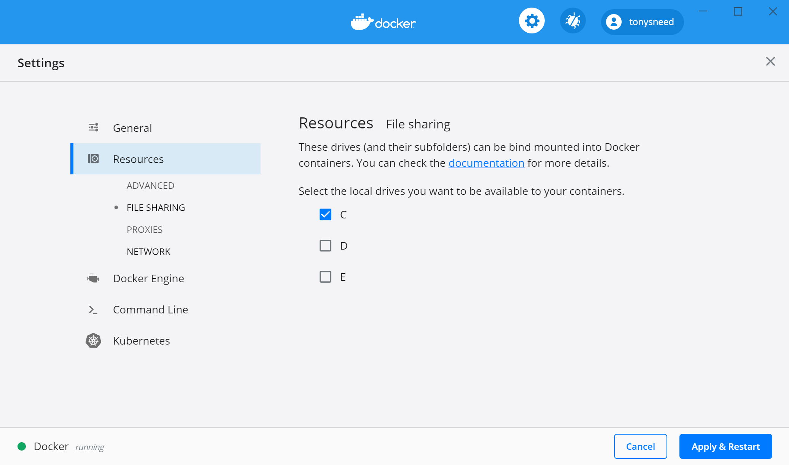
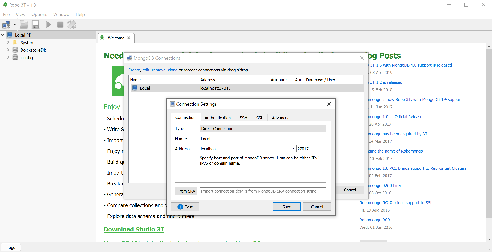

# URF Core NoSQL Demo

Sample Unit of Work and Repository Framework (URF) with NoSQL and MongoDb

## Prerequisites

- Install [Docker Desktop](https://www.docker.com/products/docker-desktop).
  - To run Docker in Windows on Parallels for Mac [enable nested virtualization](https://kb.parallels.com/en/116239).
  - To run Docker on Windows [enable Hyper-V](https://docs.microsoft.com/en-us/virtualization/hyper-v-on-windows/quick-start/enable-hyper-v#enable-the-hyper-v-role-through-settings)
- Install [Robo 3T](https://robomongo.org/download).
- Install [.NET Core SDK](https://dotnet.microsoft.com/download) 3.1 or greater.

## MongoDb via Docker

- Check that the C drive is shared with Docker.
  - From Docker, select Settings, Resources, File Sharing.
    
- Run MongoDb Version 3.x via Docker.
  - This command will mount a volume where a shared database will reside on the host system in /tmp.
    ```
    docker run --name mongo -d --rm -p 27017:27017 -v /tmp/mongo/data:/data/db mongo:3-xenial
    ```
  - Check to see if it is running.
    ```
    docker ps
    ```
- Connect to the mongo shell.
    ```
    docker exec -it mongo bash
    mongo
    ```
- Create the database, add a collection, insert data.
    ```
    use BookstoreDb
    db.createCollection('Books')
    db.Books.insertMany([{'Name':'Design Patterns','Price':54.93,'Category':'Computers','Author':'Ralph Johnson'}, {'Name':'Clean Code','Price':43.15,'Category':'Computers','Author':'Robert C. Martin'}])
    ```
- View the documents in the database.
    ```
    db.Books.find({}).pretty()
    ```
- Connect to MongoDb from Robo 3T.
    

## Web API Project

1. Create a `Models` .NET Standard 2.1 class library.
   - Add package: MongoDB.Bson
   - Add a `Book` model to the Models folder.
    ```csharp
    public class Book
    {
        [BsonId]
        [BsonRepresentation(BsonType.ObjectId)]
        public string Id { get; set; }

        [BsonElement("Name")]
        public string BookName { get; set; }

        public decimal Price { get; set; }

        public string Category { get; set; }

        public string Author { get; set; }
    }
    ```

2. Add `Api` ASP.NET Core Web API project.
   - Remove `WeatherForecast` and `WeatherForecastController` classes.
   - Add NuGet package: URF.Core.Mongo
   - Reference Models project.
- Add `BookstoreDatabaseSettings` section to appsettings.json.
    ```json
    "BookstoreDatabaseSettings": {
    "BooksCollectionName": "Books",
    "ConnectionString": "mongodb://localhost:27017",
    "DatabaseName": "BookstoreDb"
    }
    ```
- Create a `Settings` directory, add `IBookstoreDatabaseSettings` interface.
    ```csharp
    public interface IBookstoreDatabaseSettings
    {
        string BooksCollectionName { get; set; }
        string ConnectionString { get; set; }
        string DatabaseName { get; set; }
    }
    ```
- Add `BookstoreDatabaseSettings` class.
    ```csharp
    public class BookstoreDatabaseSettings : IBookstoreDatabaseSettings
    {
        public string BooksCollectionName { get; set; }
        public string ConnectionString { get; set; }
        public string DatabaseName { get; set; }
    }
    ```
3. Update `ConfigureServices` in `Startup` to register `IBookstoreDatabaseSettings` and `IMongoDatabase`.
    ```csharp
    public void ConfigureServices(IServiceCollection services)
    {
        services.AddControllers();
        services.Configure<BookstoreDatabaseSettings>(
            Configuration.GetSection(nameof(BookstoreDatabaseSettings)));
        services.AddSingleton<IBookstoreDatabaseSettings>(sp =>
            sp.GetRequiredService<IOptions<BookstoreDatabaseSettings>>().Value);
        services.AddSingleton<IMongoDatabase>(sp =>
        {
            var settings = sp.GetRequiredService<IBookstoreDatabaseSettings>();
            var client = new MongoClient(settings.ConnectionString);
            return client.GetDatabase(settings.DatabaseName);
        });
        services.AddSingleton<IMongoCollection<Book>>(sp =>
        {
            var context = sp.GetRequiredService<IMongoDatabase>();
            var settings = sp.GetRequiredService<IBookstoreDatabaseSettings>();
            return context.GetCollection<Book>(settings.BooksCollectionName);
        });
        services.AddSingleton<IDocumentRepository<Book>, DocumentRepository<Book>>();
    }
    ```

## Model Controller

1. Add `Book` Web API controller to the `Controllers` folder.

2. Inject `IDocumentRepository<Book>` into the controller ctor.
    ```csharp
    public IDocumentRepository<Book> Repository { get; }

    public BookController(IDocumentRepository<Book> repository)
    {
        Repository = repository;
    }
    ```
3. Add methods for Get, Post, Put and Delete.
    ```csharp
    // GET: api/Book
    [HttpGet]
    public async Task<ActionResult<IEnumerable<Book>>> Get()
    {
        var result = await Repository.FindManyAsync();
        return Ok(result);
    }

    // GET: api/Book/5
    [HttpGet("{id}", Name = nameof(Get))]
    public async Task<ActionResult<Book>> Get(string id)
    {
        var result = await Repository.FindOneAsync(e => e.Id == id);
        if (result == null) return NotFound();
        return Ok(result);
    }

    // POST: api/Book
    [HttpPost]
    public async Task<IActionResult> Post([FromBody] Book value)
    {
        var result = await Repository.InsertOneAsync(value);
        return CreatedAtAction(nameof(Get), new { id = value.Id }, result);
    }

    // PUT: api/Book/5
    [HttpPut("{id}")]
    public async Task<ActionResult<Book>> Put(string id, [FromBody] Book value)
    {
        if (string.Compare(id, value.Id, true) != 0) return BadRequest();
        var result = await Repository.FindOneAndReplaceAsync(e => e.Id == id, value);
        return Ok(result);
    }

    // DELETE: api/Book/5
    [HttpDelete("{id}")]
    public async Task<IActionResult> Delete(string id)
    {
        var count = await Repository.DeleteOneAsync(e => e.Id == id);
        if (count == 0) return NotFound();
        return NoContent();
    }
    ```

## Test Web API

1. Update `launchSettings.json` in the Properties folder.
   - Replace `weatherforecast` with `api/book`.
   - Set the `Api` project as the startup project.
   - Select `Api` project for debugging and press F5.

2. Start the Web API project and test with Postman.
   - Turn off 'SSL certificate verification' in Settings > General
   - Replace `id` below with actual object id.

    ```
    GET: https://localhost:5001/api/book
    GET: https://localhost:5001/api/book/5e6d2f31d40521f24f7e582f
    ```
    ```
    POST: https://localhost:5001/api/book
    ```
    ```json
    {
        "bookName": "CLR via C#",
        "price": 49.99,
        "category": "Computers",
        "author": "Jeffrey Richter"
    }
    ```
    - Should return 201 Created with correct Location response header.
    ```
    PUT: https://localhost:5001/api/book/5e6d47bfa70ee6419095d127
    ```
    ```json
    {
        "id": "5e6d47bfa70ee6419095d127", // Use generated id
        "bookName": "CLR via C#",
        "price": 59.99,
        "category": "Computers",
        "author": "Jeffrey Richter"
    }
    ```
    ```
    DELETE: https://localhost:5001/api/book/5e6d47bfa70ee6419095d127
    ```
    ```
    GET: https://localhost:5001/api/book/5e6d47bfa70ee6419095d127
    ```
    - Should return 404 Not Found.